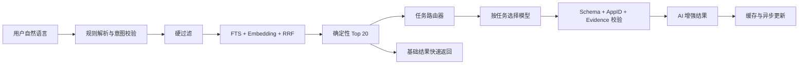
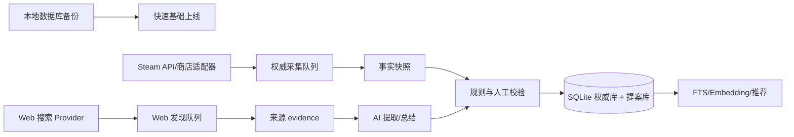

# MPGS 0.3 AI 优化 PRD（M8）

| 字段 | 内容 |
| --- | --- |
| 产品版本 | `0.3.0` |
| 阶段 | M8：AI 优化与多模型路由 |
| 文档状态 | 开发基线 |
| 基线日期 | 2026-07-21 |
| 前置条件 | M0-M7 工程基线、M5 AI/语义检索、M7 账户与社区 |
| 目标用户 | 熟人游戏小组、固定队、需要快速比较联机游戏的玩家 |

## 1. 产品结论

MPGS 的 AI 是确定性数据和推荐器之上的增强层，不是权威数据源，也不直接决定硬条件。M8 的核心目标不是增加一个通用聊天框，而是把 AI 用在四个高价值任务上：自然语言找游戏、带证据的推荐解释、游戏总结、多游戏比较。

M8 应采用“一个 Provider、多种任务模型”的路由方式。模型名称必须由配置和上游 `/v1/models` 能力发现驱动，不能把某个模型写死在业务代码中。基础推荐必须先由 SQLite、FTS、Embedding 和确定性推荐器完成；AI 超时、限流、无 Key 或返回非法 JSON 时，用户仍得到可用结果。

数据获取采用“双通道”：Steam 官方接口负责可验证的权威事实；独立 Web 搜索负责候选发现、补充公开证据和发现变更；AI 只从已抓取证据中提取结构化提案。首次启动必须优先导入本地已有数据库并快速提供基础推荐，不能等待完整目录、评价和 CCU 富化结束。

## 2. 当前基线与问题

当前代码已经具备：

- `POST /v1/recommendations/natural-language`：规则解析自然语言条件，执行硬过滤、FTS/向量混合检索，再对 Top 20 做可选 AI 分析。
- `AiProvider`、`EmbeddingProvider`、OpenAI-compatible Provider、Disabled Provider、超时/预算/熔断和确定性回退。
- AI 输出的候选 AppID、分数、理由和 evidence 约束验证。
- AI 分析缓存、离线特征物化和本地 hash embedding。
- 内置 AI、关闭 AI、自定义 OpenAI-compatible API 三种用户设置模式。

当前限制：

1. 服务端一次只配置一个 `MPGS_AI_MODEL`，还没有任务级模型路由。
2. 自然语言意图主要由规则解析，AI 不能稳定处理复杂的同义表达和多轮修正。
3. AI 分析是同步增强，首次请求可能等待上游模型；基础结果与 AI 增强没有完全解耦。
4. 游戏总结、结构化比较和小组决策尚未形成完整用户流程。
5. 当前 Embedding Provider 只有本地 hash 或通用 OpenAI-compatible 选项；本次配置的 Grok2API 模型列表没有 Embedding 模型，因此生产默认继续使用 hash embedding。

2026-07-21 的 live probe 还发现：`grok-4.5` 的 `/v1/responses` 请求可以正常完成（约 2.3 秒），但同一模型的 `/v1/chat/completions` 在多次结构化请求中间歇返回 `503`，成功请求约 15-18 秒。当前 MPGS Provider 只使用 Chat Completions，因此暂不把 `grok-4.5` 设为生产默认；M8.1 必须加入 Responses 适配和按模型能力选择协议。

## 3. 目标与非目标

### 3.1 M8 目标

- 用户可以用自然语言表达人数、平台、预算、时长、联机方式和主观偏好。
- AI 只在确定性候选集内工作，所有具体理由都能追溯到证据。
- 推荐、总结、比较和小组建议使用不同模型或不同提示策略。
- 基础结果快速可用，AI 增强可以异步完成并缓存。
- 上游模型发生 429、5xx、超时或模型下线时，按任务回退，不拖垮普通推荐。
- 能观察每个任务的模型、延迟、缓存命中、失败类型和预算消耗，但不记录完整 Key 或默认保存原始查询。
- Web 发现、Steam 采集和 AI 提取使用独立队列、预算和熔断；任一通道失败都不清空另一通道的有效快照。
- 首次部署可在导入本地数据后先上线基础推荐，再后台补齐重点候选和连续七天数据。

### 3.2 非目标

- 不让模型执行 SQL、Shell、任意 URL 请求或修改业务事实。
- 不让 AI 推荐候选集之外的 AppID。
- 不把 AI 推断伪装成 Steam 官方事实。
- 不在 M8 构建通用开放域聊天、自动购买、自动发帖或自动联络玩家。
- 不把完整 Steam 游戏库、设备标识、IP 或原始反馈历史发送给外部模型。

## 4. 用户场景

### 4.1 自然语言找游戏

用户输入：

> “找三个人能私密合作、Windows、预算 100 元以内、单局不超过 90 分钟、不要竞技压力太大的游戏。”

系统先返回符合硬条件的确定性结果，再补充 AI 理由、风险和自然语言摘要。未识别或低置信字段只能作为软偏好，不能绕过平台、人数、价格和服务状态过滤。

### 4.2 游戏详情总结

详情页提供“适合谁、怎么玩、联机依赖、评价优点、常见问题、未知项”六段式总结。总结来自商店描述、结构化多人画像和经筛选的评论主题；每个具体结论必须能展开对应证据。

### 4.3 多游戏比较

用户选择 2-4 款游戏后，服务端先生成事实矩阵，再由模型解释差异。比较结果至少覆盖人数、平台、价格、联机方式、服务依赖、内容节奏、评价质量和数据更新时间。

### 4.4 熟人小组建议

登录用户可提交小组的聚合条件和想玩票，系统输出“首选、备选、折中原因、可能冲突”。小组建议只使用聚合偏好，不公开其他成员的个人资料或原始反馈。

### 4.5 双通道数据获取与首次启动

MPGS 将外部数据分成三种角色：

1. **权威通道**：Steam Web API 和经过批准的商店适配器写入目录、价格、平台、评价、CCU 等事实；请求按游标、内容哈希和字段 TTL 增量执行。
2. **发现通道**：Web 搜索 Provider 查找官方商店页、开发者说明、服务器文档和公开评价主题，结果保存为带 URL、抓取时间和内容哈希的低置信 evidence，不直接覆盖权威字段。
3. **AI 提取通道**：模型从压缩后的 evidence 中提取私人房、跨平台、自建服务器、典型局时长等提案；高影响字段必须经过规则或人工验证后才能进入推荐画像。

首次启动顺序：

1. 导入本地 SQLite 备份和已有来源游标。
2. 立即启动 Web/API 服务，展示已有数据和采集进度。
3. 临时优先商店详情，跳过评价和 CCU 的慢富化。
4. 对前 300 个重点候选并行运行 Web 发现和 AI 提取。
5. 后台逐步补齐评价、CCU，并连续采集七天重点数据。
6. 首次门禁完成后恢复常规 15 分钟/6 小时/5 分钟调度，不重复全量扫描。

Web 搜索必须有来源白名单、URL 去重、内容哈希缓存和来源等级；普通 Chat/Responses 请求不等于联网搜索，只有经过能力探测的搜索工具或独立搜索 Provider 才能标记为 Web evidence。

## 5. 功能需求

| 编号 | 优先级 | 需求 | 验收 |
| --- | --- | --- | --- |
| AI-001 | P0 | 结构化自然语言意图 | 生成并校验人数、平台、预算、时长、模式和软偏好；硬条件不被模型覆盖 |
| AI-002 | P0 | 混合语义检索 | SQL/FTS/向量先缩小候选，RRF 与确定性推荐器产生 Top 20 |
| AI-003 | P0 | 证据型推荐解释 | 理由、注意事项、摘要均绑定候选内 evidence；证据缺失则删除或改成不确定表达 |
| AI-004 | P0 | 多模型任务路由 | 按任务选择模型、超时、最大输出和回退链；逐模型熔断 |
| AI-004A | P0 | 多协议 Provider | 支持 Chat Completions 与 Responses；模型路由必须声明协议能力，不得用 Chat 失败简单归因于模型不可用 |
| AI-005 | P0 | 确定性快速返回 | AI 失败时仍返回基础推荐；目标是基础结果不等待模型 |
| AI-006 | P0 | AI 结果缓存 | 缓存键包含任务、模型、提示版本、数据快照、输入哈希和用户偏好哈希 |
| AI-007 | P1 | 多轮筛选 | 只传结构化意图增量，不默认保存完整聊天原文 |
| AI-008 | P1 | 游戏总结 | 离线生成、内容哈希失效、证据可展开、人工审核高影响字段 |
| AI-009 | P1 | 游戏比较 | 事实矩阵由服务端生成，模型只解释，不接受任意列名或表达式 |
| AI-010 | P1 | 小组建议 | 使用聚合偏好、投票和候选事实，输出首选/备选/冲突解释 |
| AI-011 | P1 | 模型能力发现 | 定期读取 `/v1/models`，通过最小 JSON canary 检查模型可用性和能力 |
| AI-012 | P2 | 数据质检助手 | 标记多人特征冲突、疑似停服和低置信字段，进入人工队列而非自动改事实 |
| AI-013 | P0 | Web 发现队列 | 以 AppID、游戏名或缺失特征生成受控搜索任务，保存来源、哈希、时间和证据等级 |
| AI-014 | P0 | 权威/提案分层 | Steam 事实与 Web/AI 提案分开存储；提案不得直接覆盖价格、平台、人数和服务状态 |
| AI-015 | P0 | 首次启动模式 | 支持本地数据库导入、快速基础上线、重点候选优先和进度可观察 |
| AI-016 | P0 | 来源限流与熔断 | 每个主机独立 token bucket、并发上限、Retry-After、指数退避和 429 熔断 |
| AI-017 | P1 | 七日重点采集 | 仅对重点候选连续记录评价/CCU 快照，失败保留最近有效值并支持断点续传 |

## 6. 多模型路由设计

模型名称是建议默认值，最终以网关实时模型列表和 canary 结果为准。当前 Grok2API 实例在 2026-07-21 返回了 `grok-4.20-0309`、`grok-4.20-0309-non-reasoning`、`grok-4.20-0309-reasoning`、`grok-4.20-multi-agent-0309`、`grok-4.3`、`grok-4.5`、`grok-build-0.1`、`grok-chat-fast` 和 `grok-imagine-image`；这不是永久保证的静态清单。`grok-4.5` 的当前可用协议需要独立探测，不能假设 Chat 与 Responses 等价。

| 任务 | 主模型 | 回退 | 运行方式 |
| --- | --- | --- | --- |
| `intent_parse` | `grok-chat-fast` | `grok-4.20-0309-non-reasoning` -> 规则解析 | 在线，短输出 |
| `rank_explain` | `grok-4.3` | `grok-4.20-0309-non-reasoning` -> 确定性理由 | 在线，Top 20 |
| `game_summary` | `grok-4.20-0309-non-reasoning` | `grok-4.3` -> 规则摘要 | 离线批处理 |
| `compare_games` | `grok-4.20-0309-reasoning` | `grok-4.3` -> 事实矩阵 | 在线，2-4 款 |
| `group_advice` | `grok-4.20-0309-reasoning` | `grok-4.3` -> 确定性折中排序 | 在线，可异步 |
| `data_quality` | `grok-4.20-0309-non-reasoning` | 人工审核队列 | 离线 |

路由器要求：

- 启动或定期探测 `/v1/models`，模型不存在时立即跳过，不反复请求。
- 对每个模型分别探测 Chat/Responses 协议、结构化 JSON、工具调用和流式能力；能力结果进入路由缓存。
- 每个模型单独维护延迟、429、5xx、超时和无效 JSON 统计及熔断窗口。
- 多模型失败时只回退到同一任务的确定性实现，不把“模型不可用”伪装成 AI 成功。
- 支持按配置覆盖主模型和回退链，生产配置不包含 Key 以外的敏感信息。
- Grok2API 当前没有可用于 MPGS 的 Embedding 模型时，Embedding 保持 hash；不要用聊天模型冒充向量模型。

## 7. 目标架构

M8.1 先实现服务端任务路由器和渐进式返回；不要让模型直接进入 Repository。所有外部文本都视为不可信数据，继续使用字段长度限制、提示注入隔离和输出白名单。

数据采集采用独立队列，避免 AI 或慢目录任务阻塞前台：

权威采集、Web 发现、AI 提取和七日快照必须分别记录 `pending/leased/succeeded/retry/dead` 状态、游标和错误类别。每个来源使用独立限流器；收到 429 时不得通过增加并发来“抢速度”。

## 8. API 与存储建议

保留现有 `POST /v1/recommendations/natural-language` 兼容行为，新增可选的异步模式：

- `POST /v1/ai/search`：返回基础候选、结构化意图和 `analysis_id`。
- `GET /v1/ai/analyses/{analysis_id}`：读取 AI 增强状态和缓存结果。
- `POST /v1/ai/compare`：输入候选 AppID 列表，服务端生成事实矩阵。
- `GET /v1/games/{app_id}/ai-summary`：读取离线总结及更新时间。
- `POST /v1/ai/group-advice`：输入聚合小组偏好和候选 AppID，不接受原始成员隐私字段。

建议新增或扩展：

- `ai_model_routes`：任务、主模型、回退模型、启用状态、版本。
- `ai_task_runs`：任务、模型、状态、延迟、token 用量、错误类别、缓存命中；不保存 Key。
- `game_ai_summaries`：AppID、输入哈希、提示版本、摘要 JSON、证据 ID、审核状态、过期时间。
- `ai_analyses`：沿用现有表，增加任务路由和模型标识。

原始查询日志默认关闭；如启用，必须取得遥测同意、设置短保留期并进行字段脱敏。

## 9. 性能、成本与质量门槛

- 基础推荐 P95 <= 1.5 秒，不等待 AI 才能显示结果。
- 缓存 AI 增强 P95 <= 3 秒；未缓存在线增强目标 P95 <= 20 秒。
- 上游失败时确定性回退目标 <= 5 秒，不能因为 AI 无限重试。
- 导入本地数据库后，基础推荐服务目标 <= 5 分钟可用；不等待完整富化。
- 首次启动优先完成 300 个重点候选的基础画像和 Web evidence 入队，其余候选可继续后台处理。
- Web evidence 必须包含来源 URL、抓取时间、内容哈希和来源等级；重复内容不得重复计费或重复入库。
- 单账号每分钟/每日预算、全局预算、并发上限和模型级预算分开统计。
- 黄金查询集至少 100 条，覆盖人数、平台、预算、时长、联机模式和模糊偏好。
- 硬条件违反率为 0；候选外 AppID 泄漏率为 0；具体事实 evidence 覆盖率为 100%。
- 游戏总结由双人抽样复核，关键多人特征和服务依赖的事实准确率目标 >= 95%。
- 429、5xx、超时、坏 JSON、模型下线、Embedding 缺失和缓存污染均有自动化测试。

## 10. 开发分期

### M8.0：双通道采集与启动加速

- 导入本地 SQLite 备份、来源游标和已有 evidence。
- 新增 `web_discovery` 队列、来源等级、内容哈希和 Web Provider 抽象。
- Steam 权威采集、Web 发现、AI 提取和七日重点快照分离限流与重试。
- 增加首次启动模式：`store_only` 基础富化、300 个重点候选优先、进度状态和恢复。
- 验收服务不因任一外部来源 429 而停止，且导入后可先提供基础推荐。

### M8.1：路由与渐进式返回

- `AiTask`、模型注册表、能力 canary、模型级熔断。
- OpenAI-compatible Chat Completions 与 Responses 双协议适配；`grok-4.5` 优先走已验证可用的 Responses 路由。
- `intent_parse`、`rank_explain` 两类任务路由。
- 基础结果与 AI 增强解耦，缓存键补全模型和路由版本。

### M8.2：搜索与推荐体验

- AI 结构化意图解析和多轮修正。
- 搜索解释、证据展开、低置信提示。
- 前端展示 `pending/used/cached/fallback/disabled` 五种状态。

### M8.3：总结与比较

- 离线游戏总结批任务和失效机制。
- 2-4 款游戏事实矩阵、比较解释和风险提示。
- 高影响字段审核队列。

### M8.4：小组助手与质量平台

- 聚合小组建议、冲突解释和投票趋势结合。
- 模型成本、延迟、回退率和证据覆盖率仪表盘。
- 黄金集离线评测、版本对比和一键停用模型。

## 11. Definition of Done

- AI 关闭或上游不可用时，搜索、推荐、详情和社区功能完整可用。
- 每项 AI 具体事实都能回到候选证据；没有 evidence 的内容不展示。
- 多模型路由、模型缺失、429、超时和回退路径有集成测试。
- 运行日志不含 API Key、Authorization、完整 Prompt、用户原始隐私字段。
- 新模型通过 canary、结构化输出、延迟和成本门槛后才能启用。
- API/OpenAPI、前端状态、缓存和数据库迁移同步更新。
- `cargo fmt`、`cargo test --workspace --locked`、`cargo clippy --workspace --all-targets --locked -- -D warnings`、Web test/typecheck/build 全部通过。

## 12. 风险与决策

- Grok2API 的可用模型和上游账号能力会变化，必须运行时发现并保留确定性回退。
- Web 搜索结果可能过时、重复或把营销文案当事实；必须保存原文证据和来源等级，不允许 AI 直接提升为权威字段。
- Steam 商店适配器没有稳定公开契约；它只用于低置信候选发现，解析异常不能清空已有事实。
- Steam 和 Web Provider 的限额策略不同；全局并发池会互相放大 429，必须按主机隔离。
- 首次全量富化可能持续数小时；产品必须展示覆盖率、游标、下次运行时间和最近错误，而不是显示无限加载。
- 当前实测 `grok-4.3` 可完成 MPGS JSON 任务，但单次约 14 秒；在线体验必须采用渐进式返回和缓存。
- 网关项目 README 明确要求遵守 Grok 使用条款和当地法律法规；正式长期运行前应确认上游账号、代理和数据用途符合授权边界。
- 图片模型 `grok-imagine-image` 不属于 M8 核心链路；除非产品明确加入游戏媒体生成，否则不启用。
- 用户自定义 Provider 继续由设备本地保存 Key；多模型路由只对服务端内置 Provider 生效，避免把用户 Key 持久化到服务端。

## 13. 参考

- 本地 AI 安全与 Provider 约束：[docs/AI.md](AI.md)
- 当前 M5 AI 与检索实现：[docs/MVP_PLAN.md](MVP_PLAN.md)
- OpenAI-compatible Provider：[crates/ai/src/lib.rs](../crates/ai/src/lib.rs)、[crates/ai/src/openai_compat.rs](../crates/ai/src/openai_compat.rs)
- 当前自然语言推荐：[apps/server/src/api.rs](../apps/server/src/api.rs)
- Grok2API 接口、模型和使用条款说明：[chenyme/grok2api](https://github.com/chenyme/grok2api)
